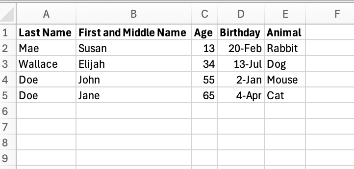
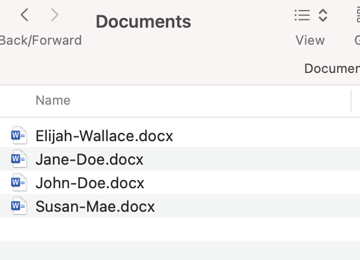
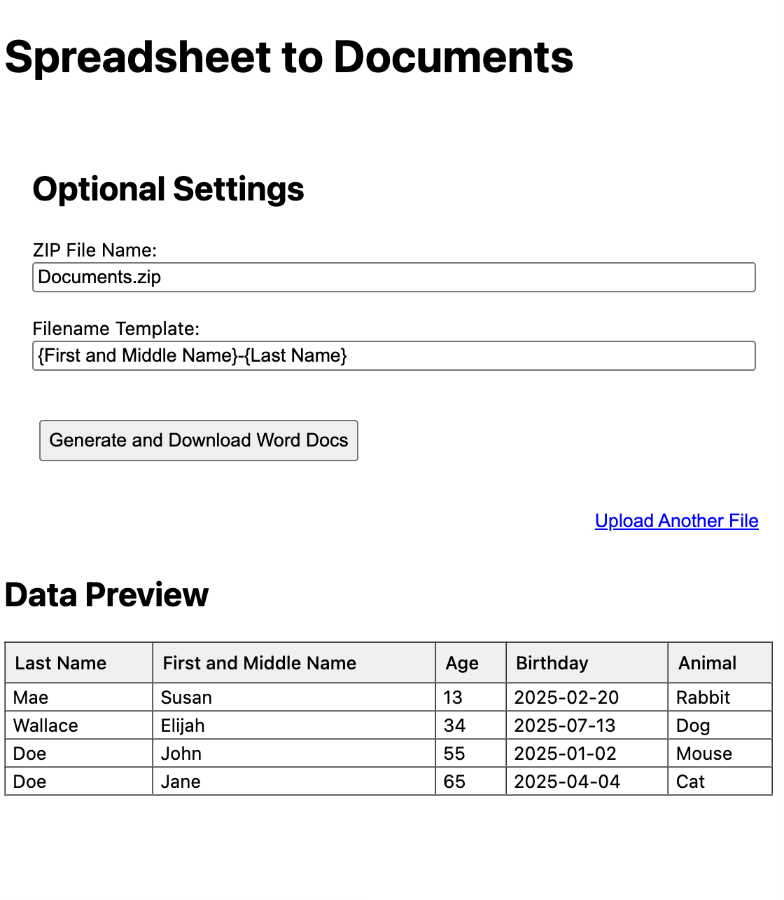

# Spreadsheet to Document(s)

## Description
This script is used to convert an xlsx or csv into a set of word documents where each document contains a row from the spreadsheet. 
The script is designed to be used with a specific spreadsheet format where the first row contains the column names and the subsequent rows contain the data. The script will create a new document for each row in the spreadsheet and will use the column names as the document titles.

## Usage 
1. Visit the [website](https://spreadsheet-to-docs-pizzapup.pythonanywhere.com/)
2. Upload the xlsx or csv file you want to convert
3. Optionally, perform any modifications to the file names/data available
4. Click the "Generate and Download Word Docs" button
5. A zip file will be downloaded containing the converted documents

## Example
- 
- 
- 
